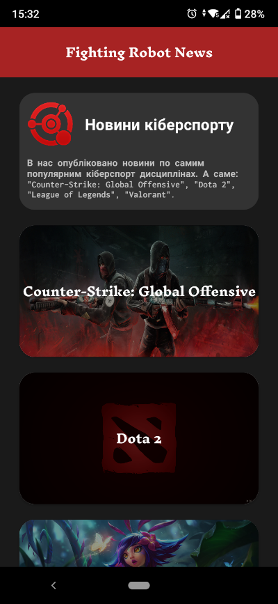
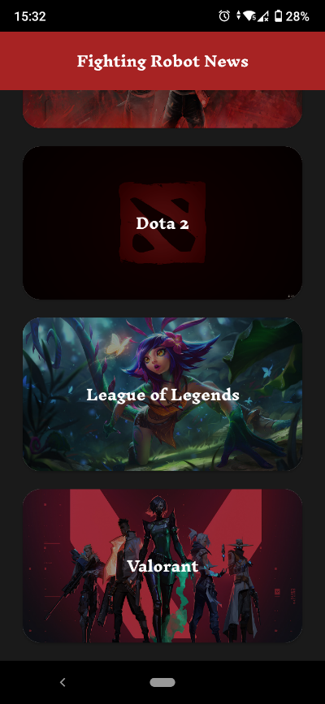
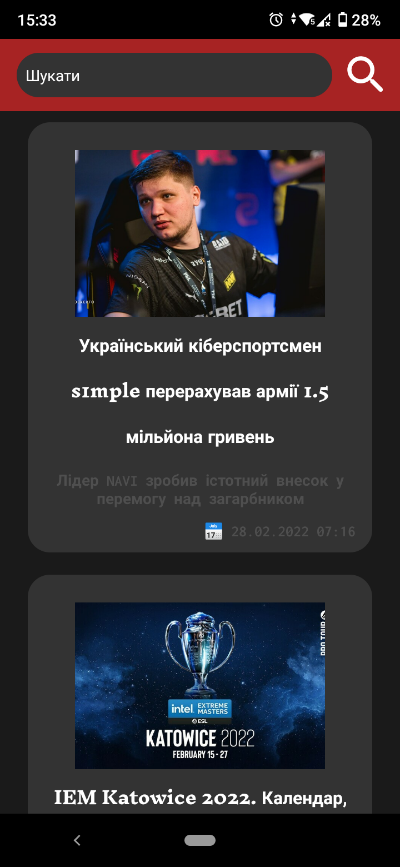
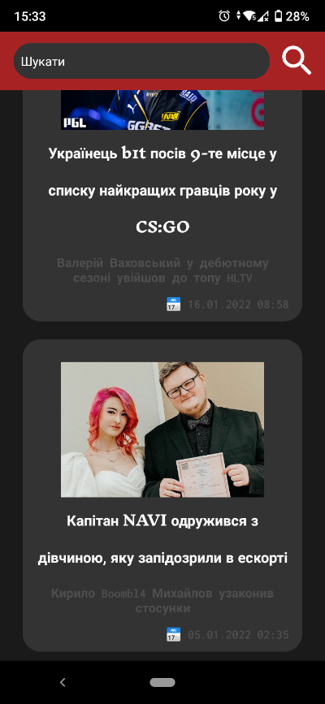
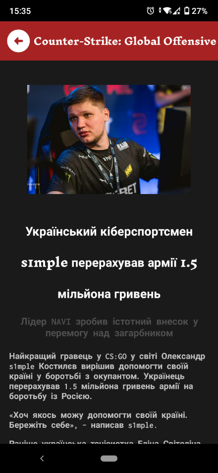
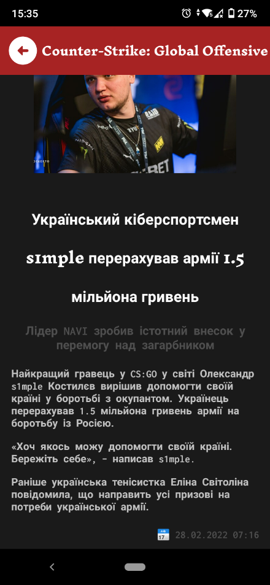

<p align="center"></p>
<h1 align="center">FightingRobotNews</h1>

## Description
<b>EN:</b>

Ordered course work on the topic "Design and development of the software product "Mobile application Cybersport"".

This is a mobile application that works through the API of the previous coursework ([fighting-robots-news.com](https://github.com/CoolOtaku/fighting-robots-news.com)).

<b>UA:</b>

Замовлена курсова робота на тему "Проектування та розробка програмного продукту «Мобільний додаток Кіберспорт»".

Це мобільний додаток, який працює через API попередньої курсової роботи ([fighting-robots-news.com](https://github.com/CoolOtaku/fighting-robots-news.com)).

#
## Screenshots
<p>
  
  
  
  
  
  
</p>

#
## Technologies used
<b>EN:</b>
- Image caching and rendering via [Picasso](https://square.github.io/picasso/)
- Using [Retrofit](https://square.github.io/retrofit/) to communicate with the site's API
- Working with the JSON format parsing into a regular object

<b>UA:</b>
- Кешування та відображення зображення через [Picasso](https://square.github.io/picasso/)
- Використання [Retrofit](https://square.github.io/retrofit/) для спілкування з API сайту
- Робота з форматом JSON парсинг в звичайний об'єкт
#
## License
```
© 2022, CoolOtaku (ericspz531@gmail.com)
```
